## Generalidades de la Estadística

### ¿Qué es la Estadística?

[Descargar en pdf](https://drive.google.com/file/d/1NOfPbNuXDsHohIIVD4_AeoAxMjZSI2Qb/view?usp=sharing)

En lenguaje coloquial acostumbramos a llamar "estadísticas" a ciertas colecciones de datos que resumen o describen algo, presentados usualmente en forma de tablas y gráficos. Así, es frecuente hablar de estadísticas de empleo, de emigración, de producción, de morbilidad, etc. Una definición de Estadística es la siguiente:

*"Es la ciencia que recolecta, organiza e interpreta datos"*

La Estadística nos enseña a realizar juicios inteligentes y tomar decisiones en presencia de incertidumbre y variación. Sin estas habría poca necesidad de métodos estadísticos es decir si todos los resistores producidos por una fábrica tuvieran el mismo valor de resistencia, si las determinaciones de pH en las muestras de suelo de un lugar en particular dieran resultados idénticos, entonces una sola observación revelaría toda la información deseada.

### Experimentos aleatorios y deterministas

Dentro de los diferentes hechos que pueden ser observados en la naturaleza, o de los experimentos que pueden ser realizados, distinguiremos dos categorías. Llamaremos *experimento o fenómeno determinista* a aquél que siempre se produce en igual forma cuando se dan las mismas condiciones. Esto ocurre, por ejemplo, con el tiempo que tarda un móvil en recorrer un espacio dado con movimiento uniforme, a velocidad constante. Por el contrario, con el término *"aleatorio"* se indica la posibilidad de que en idénticas condiciones puedan producirse resultados diferentes, que no son, por tanto, previstos de antemano. Tal ocurre, por ejemplo, al contar el número de semillas que se encuentra dentro de una vaina de guisantes, o al observar la duración de un televisor, o el tiempo transcurrido entre dos llamadas a una central telefónica, etc. Igualmente, el resultado de cualquiera de los denominados juegos de azar, como lotería, dados, monedas,etc., es impredesible de antemano. Sin embargo, si se hace una larga serie de una de tales experiencias, se observa una regularidad que es fundamental para el estudio de los fenómenos de azar y que se conoce como ley del azar o de estabilidad de las frecuencias: al repetir un mismo experimento aleatorio "A" una serie *n* de veces, el cociente *nA/n* (llamado frecuencia relativa) tiende a estabilizarse alrededor de un número que se conoce como *probabilidad* de dicho resultado.

### Orígenes de la Estadística

Los orígenes de la estadística son muy antiguos, ya que se han encontrado pruebas de recogida de datos sobre población, bienes y producción en civilizaciones como la china (aproximadamente 1000 años a. c.), sumeria y egipcia. Incluso en la Biblia, en el libro de *Números* aparecen referencias al recuento de los israelitas en edad de servicio militar. No olvidemos que precisamente fué un censo lo que motivó el viaje de José y María a Belén,según el Evangelio. Los censos propiamente dichos eran ya una institución el siglo IV a.C.en el imperio romano. Sin embargo sólo muy recientemente la estadística ha adquirido la categoría de ciencia. En el siglo XVII surge la aritmética política, desde la escuela alemana de Conring, quien imparte un curso con este título en la universidad de Helmsted. Posteriormente su discípulo Achenwall orienta su trabajo a la recogida y análisis de datos numéricos, con fines específicos y en base a los cuales se hacen estimaciones y conjeturas, es decir seobserva ya los elementos básicos del método estadístico.

Para los aritméticos políticos de los siglos XVII y XVIII la estadística era el arte de gobernar; su función era la de servir de ojos y oídos al gobierno. La proliferación de tablas numéricas permitió observar la frecuencia de distintos sucesos y el descubrimiento de leyes estadísticas. Son ejemplos notables los estudios de Graunt sobre tablas de mortalidad y esperanza de vida a partir de los registros estadísticos de Londres desde 1592 a 1603 o los de Halley entre 1687 y 1691, para resolver el problema de las rentas vitalicias en las compañías de seguros.

En el siglo XIX aparecen las leyes de los grandes números con Bernouilli y Poisson. Otro problema que recibe gran interés por parte de los matemáticos de su tiempo, como Euler, Simpson, Lagrange, Laplace, Legendre y Gauss es el del ajuste de curvas a losdatos.

La estadística logra con estos descubrimientos una relevancia científica creciente, siendo reconocida por la British AssociationfortheAdvancementofScience, como una sección en 1834, naciendo así la Royal StatisticalSociety. En el momento de su fundación se definió la estadística como "conjunto de hechos, en relación con el hombre, susceptibles de ser expresados en números, y lo suficiente numerosos para ser representados por leyes".

Se crearon poco a poco sociedades estadísticas y oficinas estadísticas para organizar la recogida de datos estadísticos; la primera de ellas en Francia en 1800. Como consecuencia, fue posible comparar las estadísticas de cada país en relación con los demás, para determinar los factores determinantes del crecimiento económico y comenzaron los congresos internacionales, con el fin de homogeneizar los métodos usados.

El primero de ellos fue organizado por Quetelet en Bruselas en 1853. Posteriormente, se decidió crear una sociedad estadística internacional, naciendo en 1885, el Instituto Internacional de Estadística(ISI) que, desde entonces celebra reuniones bianuales. Su finalidad específica es conseguir uniformidad en los métodos de recopilación y abstracción de resultados e invitar a los gobiernos al uso correcto de la estadística en la solución de los problemas políticos y sociales. En la actualidad el ISI cuenta con 5 secciones, una de las cuales, la IASE, fundada en 1991, se dedica a la promoción de la educación estadística.

### Ramas de la Estadística

Aunque es difícil dividir la estadística en partes separadas, una división clásica hasta hace unos 30 años ha sido entre [*Estadística descriptiva*]{.ul} *y [Estadística inferencial]{.ul}.*

La e*stadística descriptiva*, se utiliza para describir los datos, resumirlos y presentarlos de forma que sean fáciles de interpretar. El interés se centra en el conjunto de datos dados y no se plantea el extender las conclusiones a otros datos diferentes.

La *estadística inductiva o inferencia* trata de obtener conocimientos sobre ciertos conjuntos extensos o poblaciones, a partir de la información disponible de un subconjunto de tal población llamada muestra. Utiliza como herramienta matemática el cálculo de probabilidades.

Hasta 1900 la estadística se restringía a la estadística descriptiva, que, a pesar de sus limitaciones, hizo grandes aportaciones al desarrollo de la ciencia. A partir de esa época comenzaría la inferencia estadística, con los trabajos de Fisher, Pearson y sus colaboradores. Los avances del cálculo de probabilidades llevaron a la creación de la estadística teórica, que en cierto modo se alejó de las ideas primitivas, que se centraban en el análisis y recogida de datos.

#### Referencias:

Batanero, C. y Godino, J.D. (2001). Análisis de datos y su didáctica. Universidad de Granada. Recuperado de <https://www.ugr.es/~batanero/pages/ARTICULOS/Apuntes.pdf>

Bennett, J.O, Briggs, W.L, y Triola, M.F. 2011.Pearson.454 pag.

Devore,J. L. Probabilidad y Estadística para ingeniería y ciencias. Cengage. 715 pag.

### Importancia de la Estadística

**Poblaciones, censos y muestras**

Una población (o universo) es el conjunto total de objetos que son de interés para un problema dado. Los objetos pueden ser personas, animales, productos fabricados, etc. Cada uno de ellos recibe el nombre de elemento (o individuo) de la población. Generalmente, en un estudio estadístico, estamos interesados en analizar algún aspecto parcial de los individuos que componen la población; por ejemplo, si se trata de personas, puede que nos interese, la edad, profesión, nivel de estudios, el sueldo mensual que recibe, el número de personas de su familia, la opinión que le merece el partido que gobierna, etc. Estos aspectos parciales reciben el nombre de caracteres de los elementos de una población y son, por su naturaleza, variables, de forma que en distintos individuos pueden tomar valores o modalidades diferentes.

El principal objetivo del análisis estadístico es conocer algunas de las propiedades de la población que interesa. Si la población es finita, el mejor procedimiento será la inspección de cada individuo (siempre que esto sea posible). Un estudio estadístico realizado sobre la totalidad de una población se denomina censo. Estudios de este tipo son realizados periódicamente por el Gobierno y otras instituciones. Sin embargo, la mayoría de los problemas de interés, implican, bien poblaciones infinitas, o poblaciones finitas que son difíciles, costosas o imposibles de inspeccionar. Esto obliga a tener que seleccionar, por procedimientos adecuados, un subconjunto de n elementos de la población, que constituyen una muestra de tamaño n, examinar la característica que interesa y después generalizar estos resultados a la población.

Esta generalización a la población se realiza por medio de la parte de la estadística que se conoce con el nombre de inferencia estadística. Para que estas conclusiones ofrezcan las debidas garantías es preciso comprobar que se cumple el requisito básico de que la muestra sea representativa.

### Muestra representativa y sesgo

La mayoría de los estudios estadísticos pueden hacerse sin llevar a cabo la realización de un censo. En lugar de recolectar los datos de cada miembro de la población, se recolecta la información de una muestra para hacer inferencias acerca de la población. Por supuesto, las inferencias solo serán razonables si los elementos que integran la muestra representan bien a la población, al menos en términos de las características bajo estudio. Esto es se busca una muestra representativa de la población.

Una ***muestra representativa*** es aquella en la cual las características relevantes de los elementos que la conforman generalmente son las mismas que las características de la población.

El termino sesgo se refiere a cualquier problema en el diseño o realización de una investigación estadística que tiende a inclinarse a ciertos resultados y en consecuencia no se puede tener confianza de las conclusiones de un estudio sesgado.

Una investigación estadística sufre de ***sesgo***si su diseño o realización tiende a favorecer ciertos resultados.

El sesgo puede surgir de muchas formas. Por ejemplo:

-   Una muestra tiene sesgo si los miembros de la muestra difieren de alguna manera específica de los miembros de la población general. En tal caso, los resultados del estudio reflejarán las características inusuales de la muestra en lugar de la característica reales de la población.

-   Un investigador está sesgado si tiene un interés en un resultado particular. En este caso el investigador podría, a propósito o sin querer, distorsionar el significado real de la información.

-   El conjunto de datos podría estar sesgado si sus valores fueron recolectados, a propósito o sin querer, de una forma que los hace no representativos de la población.

-   Aún si un estudio está bien hecho, podría reportarse de una forma sesgada. Por ejemplo una gráfica que representa los datos podría decir solo parte de la historia o ilustrar la información de manera engañosa.

    

### Parámetro y estadístico

En Estadística, las características de la población se denominan ***parámetros de la población***. Aunque por lo regular se considera a una población como un grupo de personas, una población estadística puede ser cualquier clase de grupo, personas, animales o cosas. En cuanto a las características de una muestra estas son denominadas ***estadísticos***. Los estadísticos son valores que pueden determinarse a partir de datos muestrales por ejemplo la media muestral es un estimador de la media poblacional.

### Tipos de variables

Las variables se clasifican en dos tipos: [Cualitativas]{.ul} y [Cuantitativas.]{.ul}

Las variables cualitativas son aquellas que expresan cualidades o atributos.

Las variables cuantitativas son aquellas que expresan valores numéricos, dentro de estas variables se encuentran las discretas (solo toman ciertos valores) y las continuas (pueden tomar cualquier valor dentro de un intervalo determinado).

{width="600"}

### Escalas de medición

Pueden observarse muchas características diferentes para un mismo individuo. Estas características, dependiendo del tipo de valores que originan, pueden medirse con cuatro tipos distintos de escalas de medida.

**Escala nominal**

La forma más simple de observación es la clasificación de individuos en clases que simplemente pueden distinguirse entre sí pero no compararse ni realizar entre ellas operaciones aritméticas. En este tipo se incluyen características tales como la profesión, nacionalidad, grupo sanguíneo, provincia de origen, etc.

**Escala ordinal**

A veces, las categorías obtenidas pueden ser ordenadas, aunque diferenciasnuméricas iguales a lo largo de la escala numérica utilizada para medir dichas clases no correspondan a incrementos iguales en la propiedad que se mide. Por ejemplo, puede asignarse un número de orden de nacimiento a un grupo de hermanos, sin que la diferencia de edad entre el 1º y el 2º de ellos sea la misma que la del 2º al 3º. Características de este tipo son: grado de mejoría de un paciente, las puntuaciones en test de aptitud, etc.

**Escala de intervalo**

Esta escala, además de clasificar y ordenar a los individuos, cuantifica la diferencia entre dos clases, es decir, puede indicar cuanto más significa una categoría que otra. Para ello es necesario que se defina una unidad de medida y un origen, que es por su naturaleza arbitrario. Tal ocurre con la temperatura y también con la escala cronológica.

**Escala de razón**

Es idéntica a la anterior, pero además existe un cero absoluto. En el apartado anterior hemos incluido el caso del tiempo, ya que no puede medirse con una escala de razón. En efecto, si consideramos las fechas 2000 DC y 1000 DC, aunque 2000 es el doble que 1000 no quiere decirse que el tiempo desde el origen del hombre sea el doble en un caso que en otro, pues hasta el año 0 DC han transcurrido un número de años desconocido. Ejemplos de características que pueden ser medidas a nivel de razón son el volumen de ventas, coste de producción, edad, cotización de un cierto tipo de acciones, etc. El nivel elegido para medir una característica condiciona el resto del análisis estadístico, pues las técnicas utilizadas deben tener en cuenta la escala que se ha empleado. En general cuanto mayor sea el nivel utilizado, mayor número de técnicas podrán aplicarse y mayor precisión se logrará, por lo que se recomienda usar la escala de intervalo o la de razón siempre que sea posible.

## Estadística Descriptiva

Existes varios métodos para recolectar, resumir, organizar y presentar la información, en este apartado se describen cada uno de ellos.

### Medidas de localización.

Con éstas medidas se pretende tener una idea de la ubicación de los datos en algún lugar de los números reales. Es importante dar la posición del dato más pequeño, del dato más grande, de lo que en Estadística se conoce como la tendencia central de los datos y los cuantiles (que dan otras ubicaciones incluidas las centrales).

Valor mínimo y máximo. En estadística a la más pequeña observación se le denomina mínimo o primer estadístico de orden y a la más grande se le llama máximo o último estadístico de orden.

El estadístico de orden kº es igual al k-ésimo valor más pequeño de una muestra estadística.

$$X_{(1)},X_{(2)},X_{(3)},...,X_{(n)}$$

### Medidas de tendencia central

Una medida de tendencia central es un número ubicado hacia el centro de la distribución de los valores de una serie de observaciones.

Las medidas de tendencia central más utilizadas son:

1.  **Media, promedio, media aritmética o valor esperado (esperanza matemática)** $$Media \: muestral = \bar{x} = \frac{1}{n} \sum_{i=1}^{n}{x_i} $$ $$Media \: poblacional = \mu = \frac{1}{N} \sum_{i=1}^{N}{X_i} $$

2.  **Media ponderada.**

donde $w_1, w_2,...,wn$ son las ponderaciones.

3.  **Media podada (trimmed mean) o truncada**

4.  **Media geométrica. Es un buen estimador de la mediana.**

$$GM = (x_1*x_2, ...,x_{n-1}* x_n)^{1/n}$$

$$GM = exp(\bar{y}),\: \: \bar{y}=\frac {1}{n}\sum_{i=1}^{n}{ln(x_i)}$$

5.  **Mediana.**

|                                          |               |
|------------------------------------------|---------------|
| $$X_{(n+1/2)}$$                          | Si n es impar |
| $$\frac{1}{2}(X_{(n/2)}+ X_{(n/2+1)}) $$ | Si n es par   |

6.  **Moda**

<https://es.wikipedia.org/wiki/Medidas_de_tendencia_central>

### ¿Cuál medida de tendencia central usar?

#### La relación entre la gráfica de la distribución y las medidas de tendencia central.

En distribuciones unimodales cuando la media, la moda y la mediana coinciden la distribución es simétrica.

En distribuciones unimodales cuando la media, la moda y la mediana no coinciden la distribución es sesgada. Si la media es mayor que la mediana (la media a la derecha de la mediana) entonces la distribución está sesgada a la derecha (o positivamente).

Si la media es menor que la mediana (la media a la izquierda de la mediana) entonces la distribución está sesgada a la izquierda (o negativamente)

[Tendencia central y gráfica](http://www.cca.org.mx/cca/cursos/estadistica/html/m10/comoparacion_medidas.htm)

### Cuantiles

La palabra cuantil viene de la palabra cantidad. En terminos simples, un cuantil es cuando se divide al conjunto de datos en subgrupos adyascentes de igual tamaño. Especificamente, los cuantiles reciben diferentes nombres en función de la cantidad de partes en que se divide a los datos. Por ejemplo cuando se divide a los datos en 100 partes iguales, los cuantiles se denominan **percentiles** y se identifican con la notación $P_j$ (con 0 \< j \< 1) y cuando la división es en 4 partes se llaman **Cuartiles** y se identifican con $Q_k$ (k=1,2,3) $$L_p= (n+1)\frac{p}{100} $$

Ejemplo: Localizar el percentil 25 de un conjunto de datos n=15, $L_{25}=(15+1)\frac{25}{100} = 4$, , el valor que representa el percentil se encuentra en la posición 4 de las observaciones previamente ordenadas.

+-----------------------------------------------------+
| 
                                            |
|                                                     |
| Conjunto de datos                                   |
|                                                     |
| 
                                            |
+=====================================================+
| 2 4 6 [**8**]{.ul} 10 12 14 16 18 20 22 24 26 28 30 |
+-----------------------------------------------------+

### Medidas de dispersión

Indican que tan alejados se encuentran los datos de la media, valores pequeños muestran que los datos se acumulan con proximidad alrededor de la media, por lo que esta es representativa del conjunto de datos. La dispersión ayuda a realizar comparaciones entre poblaciones, si dos conjuntos de datos tienen la misma media, no indica que su dispersión sea igual.

**Amplitud**. Es la medida más sencilla de dispersión, $Amplitud= Valor Máximo - Valor Mínimo$

La amplitud es una medida muy influenciada por los valores extremos y por lo tanto puede dar una impresión falsa sobre los valores reales de la distribución.

**Varianza.** Mide la distancia (cuadrada) existente entre los valores de la serie y la media. Mientras más se aproxima a cero, más concentrados están los valores de la serie alrededor de la media. Por el contrario, mientras mayor sea la varianza, más dispersos están. El símbolo para representar a la varianza muestral es $s^2$ y para la varianza poblacional $\sigma^2$.

$$s^2=\frac{1}{n-1}{\sum_{i=1}^{n}\left(x_i-\bar{x}\right)^2}$$

$$\sigma^2=\frac{1}{N}{\sum_{i=1}^{N}\left(x_i-\mu\right)^2}$$

**Desviación estándar o típica.** Se calcula como raíz cuadrada de la varianza.

Nótese que ni la varianza ni la desviación estándar pueden ser negativas y son cero sólo cuando todos los datos tienen el mismo valor que no es otro que el valor de la media.

**Amplitud intercuartil.** Es la distancia que existe entre el cuartil 1 (divide el conjunto de datos en cuatro partes iguales) y el cuartil 3, indica que tan alejados se encuentran el 50% de los datos centrales.

Es una medida resistente de variación,puesto que elimina al 25% de datos más pequeños y al 25% de los datos mas grandes mide la amplitud del 50% de los datos centrales.

$Amplitud intercuartil= Q_3 -Q_1$

### Tabla de Distribución de Frecuencias

Agrupación de datos en clases mutuamente excluyentes, que muestra el número de observaciones que hay en cada clase. Se utiliza cuando se manejan gran cantidad de datos.

**Construcción:**

**Paso 1.** Definir el número de intervalos,

**Paso 2.** Determinar la amplitud de intervalo,

**Paso 3.** Establecer los límites de cada intervalo. El primer intervalo inicia con el número más pequeño del conjunto de datos (límite inferior),  a este valor se le suma la amplitud de intervalo (el valor obtenido es el límite superior). Para el segundo intervalo el límite superior del primer intervalo es ahora el límite inferior del segundo, a este valor se le suma la amplitud de intervalo (se obtiene límite superior del segundo intervalo). Se continúa de esta manera hasta tener el número de intervalos calculados, con la amplitud determinada.

**Paso 4.** Determinar la cantidad de datos que pertenecen a cada intervalo. Cada dato debe estar contenido en uno, cuando el valor puede colocarse en dos intervalos es necesario definir un criterio. En el ejemplo se muestra que el criterio definido es colocar el dato en el intervalo superior (siempre que sea el caso se deberá colocar en el intervalo superior).

Localizar a que intervalo pertenece el dato: 40

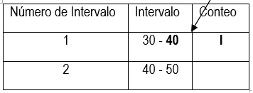{width="250"}

**Paso 5.** Determinar la Frecuencia Absoluta. Contar el número de observaciones que se localizaron en cada intervalo y escribir la cantidad.

**Paso 6.** Determinar la Frecuencia Absoluta Acumulada. El primer valor es el mismo de la Frecuencia Absoluta, a este valor se le suma el siguiente y se continúa de esta manera hasta finalizar con el total de observaciones que tiene el conjunto de datos como se muestra a continuación:

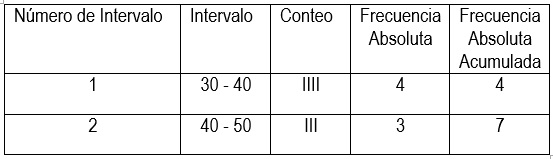{width="250"}

**Paso 7.** Determinar la  Frecuencia Relativa. Es la  proporción de observaciones que hay en un intervalo determinado y se calcula de la siguiente manera:

\$ Frecuencia Relativa=\frac{Frecuencia Absoluta}{Total de Observaciones} \$

**Paso 8.** Determinar la Frecuencia Relativa Acumulada. El primer valor es el mismo de la Frecuencia Relativa, a este valor se le suma el siguiente y se continúa de esta manera hasta finalizar con  el total de observaciones que tiene el conjunto de datos, ver paso 6.

### Métodos gráficos

Los métodos gráficos permiten organizar la información y presentarla de una manera que facilite el análisis de la misma, estos métodos permiten observar la distribución y dispersión de una población así como identificar la moda, valores extremos, etc.

#### Representación gráfica para datos cualitativos

**Gráfica de barras.** Las clases se representan en el eje horizontal y la frecuencia en el eje vertical. Las frecuencias de clase son proporcionales a las alturas de las barras. Una característica de esta herramienta es que existe una distancia o separación entre las barras.

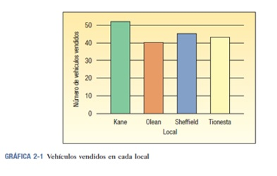{width="250"}

**Gráfica de pastel.** Muestra la parte o porcentaje que representa cada clase del total de números de frecuencia.

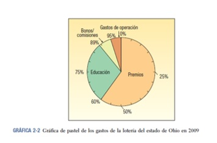{width="250"}

**Series de tiempo.** Las clases se representan en el eje horizontal (tiempo) y la frecuencia en el eje vertical. Muestran los cambios de una población bajo estudio respecto al tiempo.

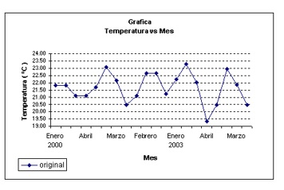{width="250"}

#### Representación gráfica para datos cuantitativos

**Histograma.** Las clases se señalan en el eje horizontal y las frecuencias de clase en el eje vertical. Las frecuencias de clase se representan por medio de las alturas de las barras, que se dibujan de manera adyacente (una enseguida de la otra). Se utiliza para conjuntos de datos grandes, muestra como es la distribución de una población.

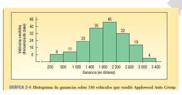{width="250"}

**Diagrama de tallo y hojas.** Permite observar la distribución que sigue el conjunto de datos, siendo posible conocer el valor individual de cada una de las observaciones. Es para variables cuantitativas y conjuntos de datos pequeños.

1.  Ordenar los datos.

2.  Se apartan uno o más dígitos de cada dato, según el número de filas que se desea obtener en general no más de 12 o 15, empezando por la izquierda. Cada valor diferente de estos dígitos apartados, se lista uno debajo del otro, trazando a la derecha de los mismos una línea vertical. Este es el tallo.

Para cada dato original se busca la línea en donde aparece su "tallo" se escribe ordenadamente el dígito que queda en la fila correspondiente. Si alguno se repite se escribe tantas veces como lo esté.

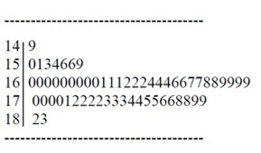{width="250"}

**Diagrama de puntos.** Muestra la dispersión y concentración de los datos. Agrupa los datos lo menos posible y evita la pérdida de identidad de cada observación. Para crear un diagrama de puntos se coloca un punto que represente a cada observación a lo largo de una recta numérica horizontal, la cual indica los valores posibles de los datos. Si hay observaciones idénticas, los puntos se apilan uno sobre otro para que se puedan ver de manera individual. Esto permite distinguir la forma de la distribución, el valor en torno al cual tienden a acumularse los datos y las observaciones máxima y mínima. Es útil en caso de conjunto de datos pequeños.

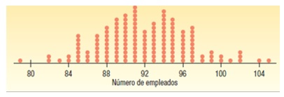{width="300"}

**Diagrama de caja y bigotes.** Representación gráfica, basada en cuartiles (divide la información en cuatro partes iguales), para su construcción se necesitan 5 estadísticos: valor mínimo,$Q_1 (cuartil 1)$, Mediana, $Q_3(cuartil 3)$ y el valor máximo.

**Ejemplo:** Calcular $Q_1=(n+1)\frac{25}{100}$, el valor resultante de esta operación es la posición en donde se encuentra el cuartil, en los datos previamente ordenados de menor a mayor.

Si la posición del cuartil es 3.25, entonces el valor del cuartil se encuentra entre 20 y 26.

12   18   [**20  26**]{.ul}   28   35   38   42   47  54   59   63 

Para obtener el valor exacto del cuartil se calcula la distancia que hay entre 20 y 26 y se multiplica por el valor decimal del cuartil (distancia recorrida a partir del valor 3).

$$
26-20=66*0.25=1.5
$$

Finalmente se suma el valor de la posición 3 más la distancia recorrida hacia el valor cuatro.

Valor 3= 20          Distancia recorrida hacia el valor 4= 1.5

$$
Q_1=20+1.5=21.5
$$

Para calcular el cuartil tres se utiliza la siguiente formula y se procede de la misma manera como se realizó anteriormente: 

$Q_1=(n+1)\frac{75}{100}$

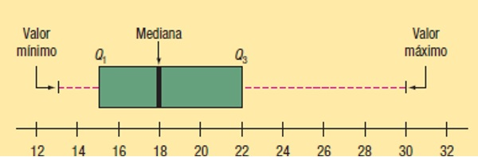{width="250"}

Este diagrama muestra la dispersión de la población, en la figura se observa que la población no es simétrica  ya que la distancia del cuartil uno y la mediana no es la misma que la distancia entre la mediana y el cuartil 3, además el bigote del lado derecho es más grande que el del lado izquierdo, se observa un sesgo hacia la derecha, lo cual indica que existe mayor dispersión de los datos de la mediana hacia el valor máximo, la dispersión de la mayoría de los datos se puede calcular mediante el rango intercuartil.

Amplitud intercuartil. Es la distancia que existe entre el cuartil 1 y el cuartil 3, indica que tan alejados se encuentra el 50 % de los datos.

Utilidad:

-   Proporciona posición relativa de la mediana, cuartiles y extremos de la distribución.

-   Informa sobre los valores atípicos.

-   Permite observar si existe simetría o asimetría de la distribución, y posible normalidad o no de la misma.

Comparación de variables de dos muestras distintas.

**Polígono de frecuencias.** Son segmentos de recta que conectan los puntos que forman las intersecciones de los puntos medios (promedios) de clase y las frecuencias de clase. El punto medio de cada clase se indica en una escala en el eje "X" y las frecuencias de clase en el eje "Y". Para calcular los valores de los extremos (inferior y superior) se debe restar a la primera marca de clase el valor de la amplitud del intervalo, para obtener elextremo superior se debe sumar a la última marca de clase el valor de la amplitud del intervalo.

Es útil para conjuntos de grandes.

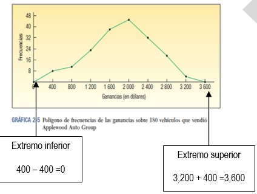{width="250"}

Los intervalos de clase se localizan a lo largo del eje de las "X" y las correspondientes frecuencias acumulativas a lo largo del eje de las "Y". Para incluir información adicional graduar en el eje vertical a la derecha los porcentajes.

**Polígono de frecuencias acumuladas (Ojiva).** Los intervalos de clase se localizan a lo largo del eje de las "X" y las correspondientes frecuencias acumulativas a lo largo del eje de las "Y". Para incluir información adicional graduar en el eje vertical a la derecha los porcentajes.

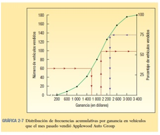{width="250"}  

**Diagrama de dispersión.** Muestra la relación entre dos variables, indica si una causa un efecto en la otra o si no existe tal efecto, la intensidad de la relación entre las variables se determina mediante el coeficiente de correlación. La correlación puede ser positiva (si la dirección de las dos variables es la misma, ver gráfica de tiempo), negativa (si la dirección de las variables es opuesta, es decir una avanza hacia la derecha y la otra hacia la izquierda, ver gráfica de precio) o que no exista correlación (los datos no siguen ningún patrón, ver gráfica de altura).

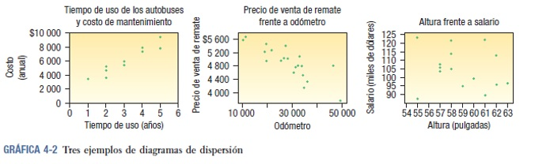{width="500"}

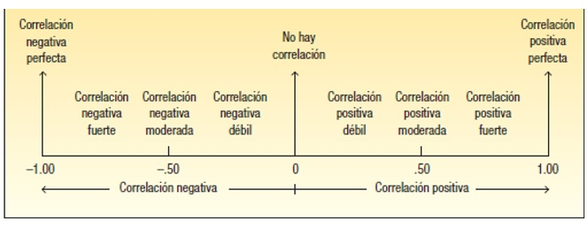{width="400"}

Para construir el diagrama se necesita indicar una variable para el eje de las "X" y otra para el eje de las "Y", estas se pueden asignar de manera indistinta o si se sospecha que alguna de ellas causa efecto (variable independiente) sobre la otra. La variable que causa el efecto se coloca en el eje horizontal (variable independiente) y la variable de respuesta (dependiente) en el eje de las "Y", finalmente se grafican los puntos correspondientes.
